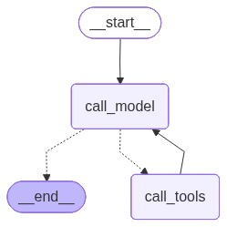

# Simple LangGraph Agent

A conversational agent built with LangGraph using the ReAct pattern (Reasoning + Acting) to provide country information.

## Features

- **Country search**: Detailed information by name or country code
- **Complete data**: Capital, neighboring countries, currencies
- **ReAct architecture**: Reasoning and actions in a loop
- **Simple interface**: Command-line chat

## Architecture



The agent follows the ReAct pattern: analysis → action (tools) → observation → new analysis.

## Installation

```bash
python -m venv venv
source venv/bin/activate  # or venv\Scripts\activate on Windows
pip install -r requirements.txt
```

## Usage

```bash
python src/main.py
```

Example queries:
- "Tell me about France"
- "What's the capital of Japan?"
- "What are the neighboring countries of Switzerland?"
